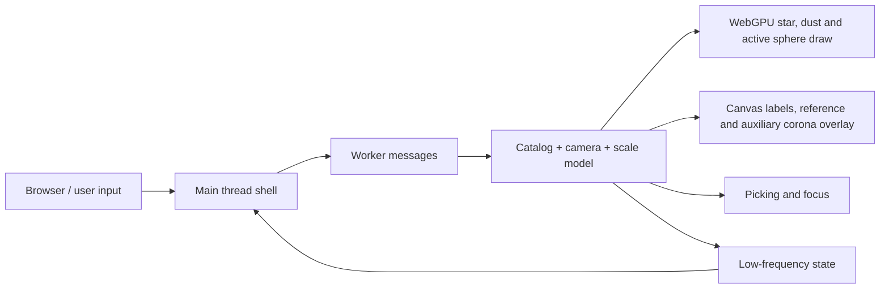

# Universe OS Design

本文档是当前项目的设计入口。它只记录稳定边界、公开契约、数据流、依赖和验证入口；具体实现、私有变量、DOM 细节和临时文案不作为契约。

## 当前边界

当前主交付面是根目录 `index.html` 启动的可缩放星图观测台。`old/` 下的模板和原型是历史参考，不是当前主入口的稳定契约。

| 边界 | 稳定契约 |
| --- | --- |
| 入口 | 通过本地静态服务器打开 `index.html`。运行环境需要 Chromium 系浏览器支持 WebGPU、Dedicated Worker 和 OffscreenCanvas；缺失能力时显示明确的不可用状态。 |
| 主线程职责 | 主线程只拥有页面壳层、canvas、尺度轴、低频状态文字、能力拦截和输入事件转发。它不生成星体、不做 catalog LOD、不遍历拾取候选。 |
| Worker 职责 | Worker 拥有 catalog 生成、LOD 选择、相机状态、WebGPU 绘制、标签绘制、拾取和焦点迁移。 |
| Catalog | 可导航恒星来自同一套 catalog。高亮、halo、标签、拾取、焦点迁移和 active 近景球体都应绑定到 catalog 索引；背景星尘和参考层只能辅助空间感。 |
| LOD | `Galactic`、`Regional`、`Local` 是对外尺度范围；内部近景语义分为 `LocalMap`、`LocalSystem` 和 `Surface`。同一颗 catalog 恒星跨星图尺度只改变可见性、尺寸、光晕、标签权重和拾取权重，不应被另一套装饰亮点替换。LOD 过渡由 layer optical mixer 控制：旧层退场时必须先收缩 halo、标签和拾取权重，再让新层成为主体；星点清晰核心不参与相邻星图 LOD 的 opacity/point-scale crossfade，普通滚轮拉近时不能出现整批核心先变小变淡、再由下一层突然变亮的周期性呼吸。相邻层 overlap 和 Galactic tail 期间应保留清晰点核、局部 PSF/小 halo、弱密度点面积、active 周边低强度 bridge 和几何参照；当拉近导致星群在屏幕上摊开时，只能通过局部点核、密度点足迹和能量补偿维持亮度，避免星点先瘦成硬核再恢复光学体积，也避免 Regional active bridge 已退而 LocalSystem/Sphere 尚未接管时出现中心亮度空窗；Galactic 到 Regional 的远景 veil 必须低强度、连续退场，不能在 overlap 中先大幅压暗再由 Regional bridge 抬亮；用于防暗的局部补偿必须有 handoff 窗口和总能量上限，不能与 Regional bridge 同峰叠加成短暂过曝。active bridge 可以作为同一 active catalog 目标的短程接力延伸到早期 LocalSystem，但必须在系统 shell 可读后退场，不能把非 active metric 星图继续带入局部空间。不能用全局柔焦、屏幕级 veil、大面积 halo 或全局曝光抽动掩盖 handoff。亮度变化应来自各层按距离独立进退、局部星点光学、active 局部光学和 sphere 主体接管；背景亮度与全局 exposure 在相邻 LOD handoff 中必须连续。滚轮连续输入期间，几何缩放可以快速响应，但亮度、halo、overlay density 和 bridge 能量必须保持帧间连续，不能因为输入事件突发、相机追随滞后或 WebGPU/overlay 分层合成产生可感知闪烁。Surface handoff 应锚定主体亮度：sphere 必须在 LocalSystem 后半段开始可读增长，active impostor 不得以固定小光球形态长时间停留后再突兀切换；一旦 sphere 半径和可见性足以承担主体，active billboard、LocalSystem shell 和参考线必须快速退场。`Regional` 必须保留远景银河残影、active 周边桥接、低亮参考弧和可读目标关系，避免成为黑底标签图。`LocalMap` 仍是星图语义，active 主要是星点/halo；进入 `LocalSystem` 后，非 active 恒星退出当前局部 metric space，只能作为极远天球背景或消失，不再保留近处视差、标签、拾取或大 halo，但画面仍必须保留预算内远景天球、极弱系统尺度提示和 active 的早期自发光 sphere preview，不能退化为空黑单标签状态，也不能停留成白色点光源加僵硬同心参考圈。`Surface` 只有在 active WebGPU sphere 已可读接管后才成为语义阶段；active billboard/halo 和 LocalSystem shell 必须退为弱锚点或消失，不能和 sphere 同时成为主体。Surface 不显示导航参考环、刻度线、轨道线或 detached 磁场线；恒星主体外只允许自然 corona/chromosphere glow 和极弱背景天球。该 sphere 是 local-domain 3D 表面模型，不是 catalog map 单位里的巨大固定半径球，也不能由 2D overlay 圆盘充当实体。 |
| 交互 | 默认焦点是 Sol，等价于 `100,000 Stars` 启动时选中太阳；滚轮连续缩放当前焦点，不按鼠标位置自动吸附到别的星；点击恒星或标签后切换焦点，平滑迁移焦点，并用同一套缩放动画快速到达该目标的近景尺度；抵达后滚轮仍可继续向内或向外缩放，不应把点击落点当作硬终点。 |
| 标签 | 标签是地图注记而不是主视觉。active 和 hover 目标必须可读；普通标签有固定预算，拖拽、滚轮和飞行期间不应全局洗牌。 |
| UI | 默认只保留沉浸 canvas、极简尺度轴、加载/能力状态和显式 debug 信息；不引入常驻大面板、顶部导航或装饰性卡片。尺度轴表达语义阶段进度，而不是原始距离或 raw scale depth。 |
| 性能 | catalog 总量可以提高，但同屏绘制、标签、拾取和状态同步必须有固定预算；不得创建 DOM 星体或每星独立 mesh/material。 |
| 多语言与可访问性 | 用户可见文案不是稳定契约；状态语义、交互语义和 canvas 可访问性说明才是稳定边界。新增文字应保留后续国际化替换空间。 |

## 公开输入

| 输入 | 语义 |
| --- | --- |
| Pointer drag | 旋转当前星图视角。 |
| Wheel | 连续跨尺度缩放当前焦点；默认焦点为 Sol，不通过 hover 或光标位置隐式切换目标。 |
| Tap/click | 命中恒星 halo 或标签时建立该 catalog 目标为焦点，并沿缩放动画快速到达近景尺度；点击不是缩放上限。 |
| `?lang=` | 选择当前内置语言族。 |
| `?debug=1` | 显示低频运行状态，用于验证 LOD、预算和性能。 |
| `?budget=` | 选择运行预算。 |
| `?catalog=` | 覆盖 catalog 总量，用于压测；不得线性放大主线程或标签工作。 |
| `?seed=` | 固定生成式 catalog。 |
| `?target=` | 指定初始焦点目标。 |

## 资产新鲜度

入口页应以版本化 URL 加载 runtime，runtime 应以版本化 URL 加载 worker。调试模式应暴露当前 runtime 版本，用于区分视觉回归和浏览器复用旧资产。

## 数据流



## 尺度相机

滚轮即时改变内部相机目标距离，真实相机用类似 `100,000 Stars` 的快速追随运动靠近目标距离，而不是直接跳当前距离、驱动独立 LOD 阈值或驱动屏幕半径。投影尺度由相机距离和动态视场派生；点击 catalog 恒星只启动飞抵动画，动画结束后仍回到同一套相机距离模型。尺度状态由统一 scale model 派生：`Galactic` 和 `Regional` 是可导航星图，`LocalMap` 是 active 目标附近的星图入口，`LocalSystem` 是 active 的局部系统语义，`Surface` 是恒星表面语义。最后两级近景共享同一个 active star presentation 主轴：`activeStarCloseness` 同时决定主体半径、active billboard 退场、LocalSystem 锚点退场、photosphere 细节、corona/glow 和 Surface readiness；`Surface` 阶段必须由该 presentation 的 sphere/atlas 可读接管强度触发，而不是仅由 raw distance、独立半径阈值或 overlay 圆盘触发。进入 `Surface` 后继续内缩应推进 surface depth，使球体半径、表面细节、corona 和局部光学仍有反馈，但不能用全局曝光变化作为缩放反馈。scale model 同时派生语义尺度轴进度和 layer optical mixer；尺度轴应展开用户可感知的 `LocalSystem`/`Surface` 段并压缩低感知 raw distance。进入 `LocalSystem` 后，catalog map 投影不再继续把非 active 恒星解释为近处 3D 点；它们必须退出标签、拾取和大 halo 预算，并转为无近处视差的远景天球、远景星群云或淡出。近景动态视场只辅助缩放感，不能承担放大恒星表面的主要职责；近景恒星应保持中等检查尺度，默认桌面视口内主体半径大致落在最短边的 12%-18%，继续内缩主要增强表面流动、边缘 emission 和 corona，而不是把 photosphere 放大到暴露贴图缺陷的巨型行星尺度。overlay 可以绘制标签、远景天球、active-only photosphere atlas、corona、chromosphere rim 和极弱系统光学锚点；它不得引入第二个独立恒星实体、独立拾取目标、独立尺度模型、无纹理径向渐变主体、长径向线、刻度线、虚线测量环或 detached 参考弧，也不能用屏幕级 blur/veil/曝光抽动替代清晰主体接管。

## Active Star Model

Local 近景的稳定边界是“同一个 catalog 目标在局部尺度中的低成本恒星光学表现层”。该表现层应更接近 `100,000 Stars` 的取舍：用缓存 photosphere 纹理流、additive 径向光学层、短促边缘 glint 和一个 active sphere 组合出恒星感，而不是依赖昂贵全屏 bloom、复杂多星 mesh、长射线日珥或巨型近景表面。近景主体允许由同源 photosphere atlas 承担可见亮度，因为这比在廉价核心显卡上做昂贵后处理更稳定；它仍然只是 active catalog 目标的表现层，不是第二个星体。近景视觉主次必须是 optical photosphere first：宽软的白热自发光、边缘 emission 和 corona 先建立恒星识别，surface atlas 只作为被光吞没的热流、颗粒和活动区细节，不能让第一眼读成一颗有贴图的浅色行星。`LocalSystem` 与 `Surface` 不是两套视觉资产的硬切换：前者应表现为中等尺寸、自发光、带弱表面身份的同一恒星，后者只是同一 presentation 的细节和边缘光学成熟状态；二者之间不得出现长期固定小光球、白色平台环、半透明壳或 Surface 与旧 billboard 互相叠成两个主体。

| 约束 | 契约 |
| --- | --- |
| 实体归属 | active sphere、catalog 点、halo、标签和拾取热区必须指向同一 catalog 索引。 |
| 绘制边界 | WebGPU 负责 catalog billboard、背景尘埃和 active sphere；canvas overlay 负责标签、远景天球与星群云、LocalSystem 早期弱光学锚点，以及 active-only 的轻量缓存 photosphere/corona/chromosphere atlas。photosphere atlas 可以使用静态源纹理烘焙出热纹理，但可见自转不能靠低频相位桶周期性换帧；运行时应复用稳定 atlas，并在绘制阶段用连续的经度向漂移/热流层与 WebGPU sphere phase 共同推进，避免一段时间静止后突然跳帧或重烘焙造成 hitch。corona/chromosphere 默认由缓存径向 glow 与程序化径向外晕承担，并用圆盘遮挡限制在主体外侧；不再默认加载方向性 corona、flare 或日珥贴图，避免近景出现线段、detached 弧线或半透明流体壳。WebGPU sphere 与 atlas 的经度相位必须由 active catalog seed 派生并连续推进；拖拽近景时采用类似 `100,000 Stars` 的星体对象姿态响应：相机 orbit 会改变 active sphere 和 overlay atlas 的投影轴向与可见经度，让恒星作为一个对象跟随视角，而不是把 photosphere 纹理相位直接绑定到鼠标拖拽。overlay 只保留由同一 active sphere 姿态投影出的轴向倾角和经度偏移，不能把自转实现成圆盘原地旋转、固定高光下的静态贴图或离散帧切换。LocalSystem 的小目标应提前进入中等尺寸、带表面纹理的白热 photosphere 预览，避免静态白色点光源平台、暗黄地貌球或小而硬的光球；Surface 阶段应保留足够的同相位 photosphere atlas 作为主体热纹理，主 atlas 亮度层、detail/flow 层和 sphere 必须一起参与同一经度相位推进，同时用可追踪的经度向热流/亮纹、低成本盘内 filament ridge 和 bright/dark 颗粒表现慢速自转。Surface 主体可读后，atlas 的盘内纹理应覆盖到可见 sphere 边界，不能缩小后露出 WebGPU 白色 limb，也不能贴着 `1R` 边界画 alpha 过渡；边缘可读性应由温和的 WebGPU 自发光 limb 和跨越内外侧的宽软 bloom 承担，bloom 不得在 `1R` 形成局部亮度峰值，外部 corona 必须从 photosphere 边缘向外单调柔和衰减，不能由多层径向光效叠出可见的反光壳、台阶环或局部高亮轮廓。自发光 glow 只能建立主体外侧的自然 corona、极弱 chromosphere、边缘泛光和短促边缘 glint；主体可读后不得再绘制贴着圆盘的人工封边、硬 rim、半透明壳或独立边缘遮罩，不能把屏幕中心固定白核覆盖在 photosphere 上，避免恒星读成被外部灯光照亮的塑料球或潮汐锁定圆盘。overlay 不拥有独立实体、拾取语义或独立表面尺度，也不得绘制导航参考环、刻度线、长径向线、detached 弧线、硬描边圆盘或无纹理径向渐变实体来冒充恒星。 |
| 材质语义 | active sphere 是白热自发光恒星材质，表面活性、边缘 emission 和慢速自转由 catalog 目标稳定派生；球体内部细节应读作被高亮吞没的 photosphere 热场，overlay atlas 可以承担主体亮度，但必须与 sphere 同相位推进并在截图中呈现表面细节位移。近景主体不得退化为外部光照塑料球、棕色低频地貌球、硬灰色描边球、屏幕锁定贴图或潮汐锁定感的静态圆盘。默认 Sol 应偏黄白并由边缘 emission、软 corona 和短促自然 glint 建立“恒星”识别，而不是靠硬边圆盘、长射线或线状日珥。 |
| 参照语义 | LocalSystem 可以保留围绕 active 目标的极弱系统光学锚点和远景天球，但不显示长径向线、刻度线、虚线测量环或 detached 参考弧；当 sphere preview 开始可读时这些锚点必须提前压低，不能成为第二层 LOD 的主体。进入 Surface 后近景空间感由球体边缘 emission、自然 corona 和远景天球承担。 |
| 预算 | 只有当前 active 目标允许使用高成本 sphere；不得把每颗 catalog 恒星升级为 mesh/material。近景光学应按 active 目标缓存并复用，初始化时可预热当前 active 的低成本 photosphere/glow atlas，避免第一次进入近景时回落成平滑小球；运行中避免每帧生成高分辨率纹理、周期性重烘焙大 atlas 或使用全屏 bloom。缓存 atlas 的平均亮度要归一化，连续自转由绘制阶段的亚像素经度漂移和 sphere shader phase 承担，避免相位桶换帧导致主体亮度呼吸、卡顿或 CPU 峰值。短促边缘 glint 只能是低透明度的自然光学附属，不能成为可见线段、测量弧或第二套 LOD 装饰。 |
| 可扩展性 | 表面纹理、旋转、corona shell、短边缘 glint 和遮挡都应挂在 active catalog 目标与 local-domain sphere 上。 |
| 交互语义 | sphere 不是新的可点击实体；点击、hover、标签和焦点仍通过 catalog 索引解析。sphere preview 可读后 active 标签应锚在主体边缘或边缘外，close Surface 阶段只保留文字锚点，标签 leader 必须退场，避免把 UI 线条误读成 photosphere 外侧结构。 |

Active sphere 的调试半径、presence、readiness、depth 和 active optical lead-in 只能辅助验证，不能替代真实画面契约：当 close sphere 状态出现时，实际画面中必须能看到同一 active 目标的实体轮廓、非均匀自发光 photosphere、强边缘 emission、自然 corona，以及主体外的远景天球像素。恒星表面应读作高温 photosphere：默认 Sol 应偏黄白而非棕橙；tone mapping 后仍应保留可见的热对流、faculae 和细颗粒光学变化，但低频暗部只能是小比例活动区或等离子体流动，不能形成岩质地貌、海陆块、外部光照塑料球或一圈清晰灰黑硬边。近景光效应使用同一 active 目标的局部 atlas/glow stack 连续承接 `LocalSystem` 和 `Surface`：第二层 LOD 的小目标也必须提前继承同一恒星的 photosphere/radial corona/sparkle 身份，而不是停留成静态白色光球；可用运行时或静态烘焙 sprite/atlas 取代昂贵全屏 bloom。该 atlas/glow 只能作为 active 星体表现层，不得重新成为第二个恒星实体。LocalSystem 的 active billboard 应在同源 photosphere/glow atlas 可读后提前退场，避免固定白点平台期；Surface 阶段由 sphere 与 photosphere atlas 共同提供主体，外层径向 corona、chromosphere 和短 glint 保持连续。近景远景天球只能使用点状星、软 halo 和星群云提供空间感，不能引入十字 spike、连接线、测量弧或其他会被误读为参考线的装饰。近景自转验证应以截图中的表面细节位移为准，而不是只看 debug phase；如果表面被均匀补光洗成固定圆盘，即使相位在变化也视为退化。Local 入口不得直接变成巨大表面球；`LocalSystem` 负责用极弱系统光学锚点和远景天球承接尺度，并允许低强度 sphere preview/glow 短暂参与来避免小光球平台期，但只有当 sphere/atlas 可读接管后 `Surface` 才能成为主体；不能让 active 小光球、同心参考圈或径向测量线停留成第二套长期 LOD。active billboard/halo 在 sphere/atlas 可读后只能保留弱锚点或消失，不得和主体竞争；halo 是局部光学附属，不能成为大面积朦胧背景。

## 依赖边界

| 依赖 | 期望行为 |
| --- | --- |
| WebGPU | 提供单 canvas 高吞吐绘制；不可用时进入能力拦截，不降级为 DOM 星图。 |
| Dedicated Worker | 隔离 catalog、渲染、LOD 和拾取工作，避免主线程随 catalog 增长而阻塞。 |
| OffscreenCanvas | 允许 Worker 拥有场景和标签 canvas。 |
| 静态服务器 | 以同源方式提供模块脚本、worker 和资源。 |

## 验证入口

影响外部行为的实现变更，应同步补充或更新自动化验证和本设计入口。

手动验证入口：

```bash
cd /Users/hys/dev/universe-os
python3 -m http.server 9020
```

然后打开：

- `http://127.0.0.1:9020/`
- `http://127.0.0.1:9020/?debug=1`
- `http://127.0.0.1:9020/?debug=1&catalog=50000`

最低验证项：

| 场景 | 应验证 |
| --- | --- |
| 启动 | 能力满足时出现首帧、ready 状态和可交互星图；能力缺失时出现不可用状态。 |
| LOD | 从 `Galactic` 到 `Regional` 到 `LocalMap`、`LocalSystem`、`Surface` 连续过渡，星体身份和焦点不出现整批替换断层；默认滚轮路径应沿 Sol 连续进入近景表面。 |
| 动态 | 拖拽惯性、滚轮目标缩放与相机快速追随、点击聚焦飞抵和 idle 慢 orbit 都保持稳定；滚轮连续输入期间不应出现帧间亮度闪烁。 |
| 接近 | 点击或显式焦点进入近景时，星点、halo、active bridge、LocalSystem 光学锚点和 WebGPU active sphere 都绑定同一 active catalog 目标；点击飞抵后滚轮仍能继续向内缩放，退出缩放时平滑回到星图。active label 在 close sphere 时不应压住球体中心。`LocalSystem` 后非 active 恒星不得继续表现为局部空间内的近处 3D 点；远景天球要保留可感知的星点密度但不能重新开放标签、拾取或近处视差；Surface 不得保留 LocalSystem 几何参考线、刻度线、轨道线或 detached 磁场弧；debug 应暴露 scale stage、semantic scale axis progress、layer presence/point/halo scale、metric core visibility/radius continuity、metric PSF continuity、active bridge handoff、label/pick weight、celestial backdrop presence、local system presence、surface presence/readiness/depth、active optical lead-in、global veil/haze budget、active halo ratio、exposure 和 sphere 屏幕半径，用于验证旧层语义先退场、新层再接管，星点核心和小 halo 面积不被 LOD handoff 熄灭，active 周边不出现接力空窗，且背景亮度不出现阶段性抽动。 |
| 预算 | 高 catalog 参数不让标签、拾取或主线程工作无界增长。 |
| 多语言 | 状态文本可替换，测试和契约不绑定具体英文或中文文案。 |

自动化验证入口：

```bash
python3 tests/lod_visual_smoke.py
```

该脚本固定种子打开 debug 模式，捕获连续滚轮帧序列以及 `Galactic`、`Galactic-regional-tail`、`Galactic-regional-mix`、`Regional-entry`、`Regional-mid`、`Local-map-entry`、`Local-system-entry`、`Local-system`、`Sphere-emerge`、`Sphere-close`、`Surface-settled` 的同机位延时帧、点击接近、焦点继续深缩放和 `Zoom-out` 状态，用于验证 LOD 连续性、相邻星图 LOD 的 star core continuity、Galactic 到 Regional 的 veil/exposure 与 PSF/halo/密度点面积连续性、Galactic 到 Regional 不出现短暂过曝峰值、连续滚轮期间不出现帧间亮度闪烁、Regional 到 LocalMap/早期 LocalSystem 的 active bridge 接续、LocalSystem 远景天球语义和像素密度、Surface 可读接管、active billboard/LocalSystem 主体退场、Surface 无导航参考线/刻度线/detached 弧线、surface depth 深缩放反馈、active sphere 可见性/自发光材质/非均匀表面/自然 corona 语义、同一机位下 photosphere 可见自转而非屏幕锁定、LocalSystem/Surface 去全局朦胧化、LOD active 中心亮度/背景亮度与曝光连续性、Surface 主体亮度锚定、能力拦截、资产版本可见性和固定标签预算。

## 演进文档

向 `100,000 Stars` 美术和尺度旅行体验演进的计划见 `design/evolution.md`。
