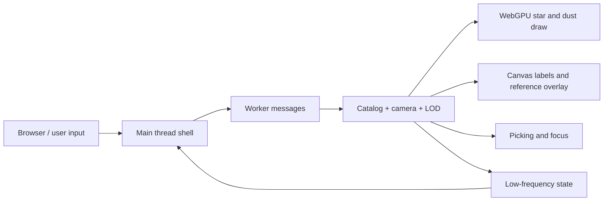

# Universe OS Design

本文档是当前项目的设计入口。它只记录稳定边界、公开契约、数据流、依赖和验证入口；具体实现、私有变量、DOM 细节和临时文案不作为契约。

## 当前边界

当前主交付面是根目录 `index.html` 启动的可缩放星图观测台。`old/` 下的模板和原型是历史参考，不是当前主入口的稳定契约。

| 边界 | 稳定契约 |
| --- | --- |
| 入口 | 通过本地静态服务器打开 `index.html`。运行环境需要 Chromium 系浏览器支持 WebGPU、Dedicated Worker 和 OffscreenCanvas；缺失能力时显示明确的不可用状态。 |
| 主线程职责 | 主线程只拥有页面壳层、canvas、尺度轴、低频状态文字、能力拦截和输入事件转发。它不生成星体、不做 catalog LOD、不遍历拾取候选。 |
| Worker 职责 | Worker 拥有 catalog 生成、LOD 选择、相机状态、WebGPU 绘制、标签绘制、拾取和焦点迁移。 |
| Catalog | 可导航恒星来自同一套 catalog。高亮、halo、标签、拾取和焦点迁移都应绑定到 catalog 索引；背景星尘和参考层只能辅助空间感。 |
| LOD | `Galactic`、`Regional`、`Local` 是连续缩放范围。同一颗 catalog 恒星跨尺度只改变可见性、尺寸、光晕、标签权重和拾取权重，不应被另一套装饰亮点替换。 |
| 交互 | 拖拽旋转星图并保留惯性；滚轮连续缩放，并以光标位置提供弱锚点；点击恒星或标签后平滑迁移焦点和推荐尺度。 |
| 标签 | 标签是地图注记而不是主视觉。active 和 hover 目标必须可读；普通标签有固定预算，拖拽、滚轮和飞行期间不应全局洗牌。 |
| UI | 默认只保留沉浸 canvas、极简尺度轴、加载/能力状态和显式 debug 信息；不引入常驻大面板、顶部导航或装饰性卡片。 |
| 性能 | catalog 总量可以提高，但同屏绘制、标签、拾取和状态同步必须有固定预算；不得创建 DOM 星体或每星独立 mesh/material。 |
| 多语言与可访问性 | 用户可见文案不是稳定契约；状态语义、交互语义和 canvas 可访问性说明才是稳定边界。新增文字应保留后续国际化替换空间。 |

## 公开输入

| 输入 | 语义 |
| --- | --- |
| Pointer drag | 旋转当前星图视角。 |
| Wheel | 连续跨尺度缩放。 |
| Tap/click | 命中恒星 halo 或标签时聚焦该 catalog 目标。 |
| `?lang=` | 选择当前内置语言族。 |
| `?debug=1` | 显示低频运行状态，用于验证 LOD、预算和性能。 |
| `?budget=` | 选择运行预算。 |
| `?catalog=` | 覆盖 catalog 总量，用于压测；不得线性放大主线程或标签工作。 |
| `?seed=` | 固定生成式 catalog。 |
| `?target=` | 指定初始焦点目标。 |

## 数据流



## 依赖边界

| 依赖 | 期望行为 |
| --- | --- |
| WebGPU | 提供单 canvas 高吞吐绘制；不可用时进入能力拦截，不降级为 DOM 星图。 |
| Dedicated Worker | 隔离 catalog、渲染、LOD 和拾取工作，避免主线程随 catalog 增长而阻塞。 |
| OffscreenCanvas | 允许 Worker 拥有场景和标签 canvas。 |
| 静态服务器 | 以同源方式提供模块脚本、worker 和资源。 |

## 验证入口

当前项目还没有自动化测试。设计变更或影响外部行为的实现变更，应先补对应验证，再改契约。

手动验证入口：

```bash
cd /Users/hys/dev/universe-os
python3 -m http.server 9020
```

然后打开：

- `http://127.0.0.1:9020/`
- `http://127.0.0.1:9020/?debug=1`
- `http://127.0.0.1:9020/?debug=1&catalog=50000`

最低验证项：

| 场景 | 应验证 |
| --- | --- |
| 启动 | 能力满足时出现首帧、ready 状态和可交互星图；能力缺失时出现不可用状态。 |
| LOD | 从 `Galactic` 到 `Regional` 到 `Local` 连续过渡，星体身份、标签和焦点不出现整批替换断层。 |
| 动态 | 拖拽惯性、滚轮缩放、点击聚焦和 idle 慢 orbit 都保持稳定。 |
| 预算 | 高 catalog 参数不让标签、拾取或主线程工作无界增长。 |
| 多语言 | 状态文本可替换，测试和契约不绑定具体英文或中文文案。 |

## 演进文档

向 `100,000 Stars` 美术和尺度旅行体验演进的计划见 `design/evolution.md`。
