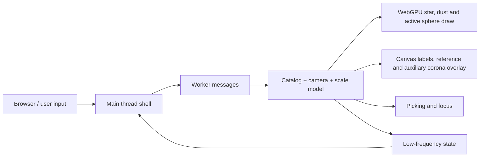

# Universe OS Design

本文档是当前项目的设计入口。它只记录稳定边界、公开契约、数据流、依赖和验证入口；具体实现、私有变量、DOM 细节和临时文案不作为契约。

## 当前边界

当前主交付面是根目录 `index.html` 启动的可缩放星图观测台。`old/` 下的模板和原型是历史参考，不是当前主入口的稳定契约。

| 边界 | 稳定契约 |
| --- | --- |
| 入口 | 通过本地静态服务器打开 `index.html`。运行环境需要 Chromium 系浏览器支持 WebGPU、Dedicated Worker 和 OffscreenCanvas；缺失能力时显示明确的不可用状态。 |
| 主线程职责 | 主线程只拥有页面壳层、canvas、尺度轴、低频状态文字、能力拦截和输入事件转发。它不生成星体、不做 catalog LOD、不遍历拾取候选。 |
| Worker 职责 | Worker 拥有 catalog 生成、LOD 选择、相机状态、WebGPU 绘制、标签绘制、拾取和焦点迁移。 |
| Catalog | 可导航恒星来自同一套 catalog。高亮、halo、标签、拾取、焦点迁移和 active 近景球体都应绑定到 catalog 索引；背景星尘和参考层只能辅助空间感。 |
| LOD | `Galactic`、`Regional`、`Local` 是对外尺度范围；内部近景语义分为 `LocalMap`、`LocalSystem` 和 `Surface`。同一颗 catalog 恒星跨星图尺度只改变可见性、尺寸、光晕、标签权重和拾取权重，不应被另一套装饰亮点替换。LOD 过渡由 layer optical mixer 控制：旧层退场时必须先收缩点尺寸、halo、标签和拾取权重，再让新层成为主体。`Regional` 必须保留远景银河残影、active 周边桥接、低亮参考弧和可读目标关系，避免成为黑底标签图。`LocalMap` 仍是星图语义，active 主要是星点/halo；进入 `LocalSystem` 后，非 active 恒星退出当前局部 metric space，只能作为极远天球背景或消失，不再保留近处视差、标签、拾取或大 halo。`Surface` 才由绑定 active catalog 目标的 WebGPU sphere 接管；该 sphere 是 local-domain 3D 表面模型，不是 catalog map 单位里的巨大固定半径球，也不能由 2D overlay 圆盘充当实体。 |
| 交互 | 默认焦点是 Sol，等价于 `100,000 Stars` 启动时选中太阳；滚轮连续缩放当前焦点，不按鼠标位置自动吸附到别的星；点击恒星或标签后切换焦点，平滑迁移焦点，并用同一套缩放动画快速到达该目标的近景尺度；抵达后滚轮仍可继续向内或向外缩放，不应把点击落点当作硬终点。 |
| 标签 | 标签是地图注记而不是主视觉。active 和 hover 目标必须可读；普通标签有固定预算，拖拽、滚轮和飞行期间不应全局洗牌。 |
| UI | 默认只保留沉浸 canvas、极简尺度轴、加载/能力状态和显式 debug 信息；不引入常驻大面板、顶部导航或装饰性卡片。尺度轴表达语义阶段进度，而不是原始距离或 raw scale depth。 |
| 性能 | catalog 总量可以提高，但同屏绘制、标签、拾取和状态同步必须有固定预算；不得创建 DOM 星体或每星独立 mesh/material。 |
| 多语言与可访问性 | 用户可见文案不是稳定契约；状态语义、交互语义和 canvas 可访问性说明才是稳定边界。新增文字应保留后续国际化替换空间。 |

## 公开输入

| 输入 | 语义 |
| --- | --- |
| Pointer drag | 旋转当前星图视角。 |
| Wheel | 连续跨尺度缩放当前焦点；默认焦点为 Sol，不通过 hover 或光标位置隐式切换目标。 |
| Tap/click | 命中恒星 halo 或标签时建立该 catalog 目标为焦点，并沿缩放动画快速到达近景尺度；点击不是缩放上限。 |
| `?lang=` | 选择当前内置语言族。 |
| `?debug=1` | 显示低频运行状态，用于验证 LOD、预算和性能。 |
| `?budget=` | 选择运行预算。 |
| `?catalog=` | 覆盖 catalog 总量，用于压测；不得线性放大主线程或标签工作。 |
| `?seed=` | 固定生成式 catalog。 |
| `?target=` | 指定初始焦点目标。 |

## 资产新鲜度

入口页应以版本化 URL 加载 runtime，runtime 应以版本化 URL 加载 worker。调试模式应暴露当前 runtime 版本，用于区分视觉回归和浏览器复用旧资产。

## 数据流



## 尺度相机

滚轮即时改变内部相机目标距离，真实相机用类似 `100,000 Stars` 的快速追随运动靠近目标距离，而不是直接跳当前距离、驱动独立 LOD 阈值或驱动屏幕半径。投影尺度由相机距离和动态视场派生；点击 catalog 恒星只启动飞抵动画，动画结束后仍回到同一套相机距离模型。尺度状态由统一 scale model 派生：`Galactic` 和 `Regional` 是可导航星图，`LocalMap` 是 active 目标附近的星图入口，`LocalSystem` 是 active 的局部系统语义，`Surface` 是恒星表面语义。scale model 同时派生语义尺度轴进度和 layer optical mixer；尺度轴应展开用户可感知的 `LocalSystem`/`Surface` 段并压缩低感知 raw distance。进入 `LocalSystem` 后，catalog map 投影不再继续把非 active 恒星解释为近处 3D 点；它们必须退出标签、拾取和大 halo 预算，并转为无近处视差的远景天球或淡出。近景动态视场只辅助缩放感，不能承担放大恒星表面的主要职责。overlay 可以绘制标签、参考线、远景天球、corona、系统 shell 和随 active sphere 半径/可见性耦合的表面可见辅助层；它不得引入第二个独立恒星实体、独立拾取目标或独立尺度模型。

## Active Star Model

Local 近景的稳定边界是“同一个 catalog 目标在局部尺度中的球体表现层”：

| 约束 | 契约 |
| --- | --- |
| 实体归属 | active sphere、catalog 点、halo、标签和拾取热区必须指向同一 catalog 索引。 |
| 绘制边界 | WebGPU 负责 catalog billboard、背景尘埃和 active sphere；canvas overlay 负责标签、参考弧、弱 halo、远景天球、local reference frame、corona、local system shell，以及由 active sphere 的半径和 presence 驱动的表面可见辅助层；overlay 不拥有独立实体、拾取语义或独立表面尺度。 |
| 材质语义 | active sphere 是自发光恒星材质，表面活性、边缘 emission 和慢速自转由 catalog 目标稳定派生；不得退化为外部光照塑料球或屏幕贴图滑动。 |
| 参照语义 | Local 近景必须保留围绕 active 目标的低亮尺度环、系统 shell、赤道/倾角参考和远景天球；reference frame 是 active 目标表现层，不是新的可点击实体。 |
| 预算 | 只有当前 active 目标允许使用高成本 sphere；不得把每颗 catalog 恒星升级为 mesh/material。 |
| 可扩展性 | 表面纹理、旋转、corona shell、flare、磁场线和遮挡都应挂在 active catalog 目标与 local-domain sphere 上。 |
| 交互语义 | sphere 不是新的可点击实体；点击、hover、标签和焦点仍通过 catalog 索引解析。 |

Active sphere 的调试半径和 presence 只能辅助验证，不能替代真实画面契约：当 close sphere 状态出现时，实际 scene canvas 中必须能看到实体球体轮廓、非均匀自发光表面和边缘 emission。Local 入口不得直接变成巨大表面球；`LocalSystem` 负责用系统 shell 和远景天球承接尺度，`Surface` 才由 sphere 主体接管。

## 依赖边界

| 依赖 | 期望行为 |
| --- | --- |
| WebGPU | 提供单 canvas 高吞吐绘制；不可用时进入能力拦截，不降级为 DOM 星图。 |
| Dedicated Worker | 隔离 catalog、渲染、LOD 和拾取工作，避免主线程随 catalog 增长而阻塞。 |
| OffscreenCanvas | 允许 Worker 拥有场景和标签 canvas。 |
| 静态服务器 | 以同源方式提供模块脚本、worker 和资源。 |

## 验证入口

影响外部行为的实现变更，应同步补充或更新自动化验证和本设计入口。

手动验证入口：

```bash
cd /Users/hys/dev/universe-os
python3 -m http.server 9020
```

然后打开：

- `http://127.0.0.1:9020/`
- `http://127.0.0.1:9020/?debug=1`
- `http://127.0.0.1:9020/?debug=1&catalog=50000`

最低验证项：

| 场景 | 应验证 |
| --- | --- |
| 启动 | 能力满足时出现首帧、ready 状态和可交互星图；能力缺失时出现不可用状态。 |
| LOD | 从 `Galactic` 到 `Regional` 到 `LocalMap`、`LocalSystem`、`Surface` 连续过渡，星体身份和焦点不出现整批替换断层；默认滚轮路径应沿 Sol 连续进入近景表面。 |
| 动态 | 拖拽惯性、滚轮目标缩放与相机快速追随、点击聚焦飞抵和 idle 慢 orbit 都保持稳定。 |
| 接近 | 点击或显式焦点进入近景时，星点、halo、LocalSystem shell、WebGPU active sphere 和 local reference frame 都绑定同一 active catalog 目标；点击飞抵后滚轮仍能继续向内缩放，退出缩放时平滑回到星图。active label 在 close sphere 时不应压住球体中心。`LocalSystem` 后非 active 恒星不得继续表现为局部空间内的近处 3D 点；debug 应暴露 scale stage、semantic scale axis progress、layer presence/point scale/label weight/pick weight、celestial backdrop presence、local system presence、surface presence 和 sphere 屏幕半径，用于验证旧层先退场、新层再接管。 |
| 预算 | 高 catalog 参数不让标签、拾取或主线程工作无界增长。 |
| 多语言 | 状态文本可替换，测试和契约不绑定具体英文或中文文案。 |

自动化验证入口：

```bash
python3 tests/lod_visual_smoke.py
```

该脚本固定种子打开 debug 模式，捕获 `Galactic`、`Regional-entry`、`Regional-mid`、`Local-map-entry`、`Local-system`、`Sphere-emerge`、`Sphere-close`、`Local-reference`、点击接近、焦点继续深缩放和 `Zoom-out` 状态，用于验证 LOD 连续性、LocalSystem 远景天球语义、active sphere 可见性/材质/参照语义、能力拦截、资产版本可见性和固定标签预算。

## 演进文档

向 `100,000 Stars` 美术和尺度旅行体验演进的计划见 `design/evolution.md`。
